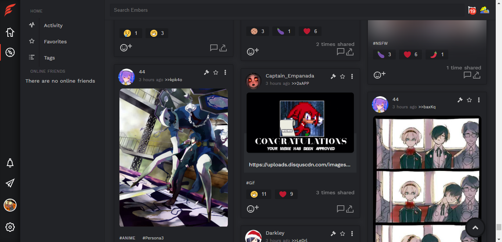

A social platform built with Elixir and Phoenix Framework

> **Warning**: the current frontend code is being refactored and it may break
> often. For instance, landing page is non-existent.Backend code requires
> refactoring, as many parts of it are messy/undocumented.

> This was previously a spanish-only project, some parts may need to be
> translated to english. Email-related stuff may be broken.

## About

Embers is a microblogging platform alternative to mainstream social networks.
You can use it to follow friends and share anything you want: pictures, videos,
text and links.
It was born out of the idea of "can I build something like Twitter" and as a
learning exercise, so there weren't clear goals from the start. However, it is
an opportunity to build spaces for small communities that feel out of place in
the more massive social networks.

## Goals

- Work in low-end devices.
- Avoid tracking as much as possible.
- Not rely on users personal data, like real names, location, etc. The less personal data we store, the better.

## Features

**Real-time timeline**

See what your friends post in real time in your home timeline.

**Media attachments**

Upload images and short webm/mp4 videos attached to your posts.

**React to posts**

Instead of just having a binary +1/-1 system, you can use one(or more!) of a
set of predefined reactions, like love or sadness.

**Save what you like**

You can add the posts you like to your personal favorites list and keep them
for later.

**Tag your content**

Add tags to your posts, either via #hashtags or with a dedicated interface(to
avoid polluting images with hashtags).

**Follow and block people and tags**

You can follow people to see their posts in your timeline, you can follow tags
too. You can also block them to never see them again.

**Content warnings**

A tag based content warning allows you to filter Not Safe For Work content.

**Moderation tools**

You can report posts that violate your Code of Conduct, moderators can remove
infringing content, ban users, and manually add content warnings.

## Requirements

- [Elixir](https://elixir-lang.org/) (and Erlang). Works fine with Elixir 1.11
  and OTP 23.
- [PostgreSQL](https://www.postgresql.org/)
- [NodeJS](https://nodejs.org)
- [Google Recaptcha](https://developers.google.com/recaptcha/) keys

If using docker-compose, only Google Recaptcha keys are needed.

## Development with docker

You can use docker-compose to set up a development environment with docker by
running `docker-compose`. After doing that, follow the steps listed in the
Getting Started section.

## Getting started

### Backend

Before trying to compile Embers, a `config/ENV.secret.exs` file is needed. You
can find an example file for the `dev` environment in the `config` folder.

- Get dependencies with `mix deps.get`
- Copy static files with `cp -R assets/static priv`.\*
- Setup the database with `mix ecto.setup`. This will create the databse, run
  migrations and seed data.
- You can now run it with `mix phx.server` ot `iex -S mix phx.server`.

\* This step is needed because in order to inline svg files in templates,
`phoenix_inline_svg` needs them to be in `priv/static`, but svg files are also
loaded by the frontend code. This should be addressed in the future.

### Frontend

Source files for the frontend(js, scss, static files) live in the `/assets`
folder.

- Install dependencies with `npm install` | `yarn`.
- Build it with `npm run build` | `yarn build`, or `npm run dev` | `yarn dev` to
  run in watch mode.

After running these steps, the app should be accessible from
[`localhost:4000`](http://localhost:4000).

A default admin account is created with credentials `admin:yayapapaya`.

## Building a release

You can build an OTP release for deployment by running the `release.sh` script.
Built releases will be output to the `artifacts` folder.

## Documentation

Documentation can be generated by running `mix docs`. After that, it will be
available in the `doc` folder.

## License

Copyright (C) 2020 dorgandash+embers@gmail.com

This program is free software: you can redistribute it and/or modify
it under the terms of the GNU General Public License as published by
the Free Software Foundation, either version 3 of the License, or
(at your option) any later version.

This program is distributed in the hope that it will be useful,
but WITHOUT ANY WARRANTY; without even the implied warranty of
MERCHANTABILITY or FITNESS FOR A PARTICULAR PURPOSE. See the
GNU General Public License for more details.

You should have received a copy of the GNU General Public License
along with this program. If not, see <https://www.gnu.org/licenses/>.
